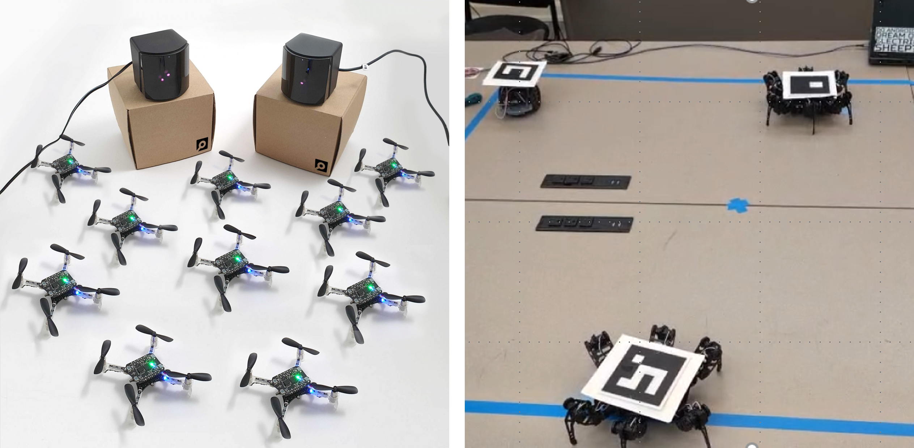

# Project Description

## Heterogeneous Swarm Robotics Education

### Two Swarms. One Mission.

The Heterogeneous Swarm Robotics project is an educational and research-oriented robotics project focused on the design, development, and experimental validation of cooperative aerial and ground robotic swarms.

The project will guide students through the complete development process, beginning with the control of individual robots, progressing toward homogeneous aerial and ground swarms, and finally integrating both systems into a heterogeneous robotic swarm capable of performing cooperative missions.

The primary application scenario is **Search and Rescue**, although the same robotic technologies and swarm concepts may later be extended to applications such as exploration, surveillance, transportation, logistics, human assistance, inspection, and security.

## Project Documents

The complete project proposal is available in the following formats:

- [📕 View Project Proposal - PDF](Heterogeneous_Swarm_Robotics_Project_Proposal_Expanded_References v2.pdf)
- [📄 Download Project Proposal - Word](Heterogeneous_Swarm_Robotics_Project_Proposal_Expanded_References v2.docx)

---

# Why This Project Matters

Many robotic applications require capabilities that cannot easily be provided by a single robot.

Aerial and ground robots have complementary capabilities.

### Aerial Robots

Aerial robots can:

- rapidly explore an area,
- observe environments from above,
- access locations that may be difficult for ground robots,
- provide global situational awareness,
- and support search and monitoring operations.

### Ground Robots

Ground robots can:

- inspect areas at close range,
- operate near objects and people,
- carry sensors or small payloads,
- interact more directly with the environment,
- and generally operate longer than small aerial robots.

The central idea of this project is that these capabilities can become more useful when multiple robots cooperate as a team.

The long-term challenge is therefore not simply to operate several robots at the same time, but to make them **coordinate, organize, navigate, and cooperate as a heterogeneous robotic swarm**.

---

# Main Engineering Challenge

The aerial and ground swarms are fundamentally different robotic systems.

The aerial swarm will use **Crazyflie drones** and the **Lighthouse positioning system**.

The ground swarm will use mobile robots controlled by **ESP32 microcontrollers**, with global localization obtained from an **overhead camera and ArUco markers**.

These systems have different:

- localization technologies,
- communication architectures,
- motion dynamics,
- control systems,
- update rates,
- operating spaces,
- and physical constraints.

The ground robots primarily move in a two-dimensional environment, while the Crazyflie drones operate in three dimensions.

One of the principal engineering questions of the project is:

> **How can independently developed aerial and ground robotic swarms be coordinated so that they operate cooperatively as one heterogeneous robotic system?**

---

# Overall Project Objective

The main objective is to:

> **Design, develop, and experimentally validate a heterogeneous swarm robotics platform composed of independently developed aerial and ground robotic swarms.**

The project will include:

- robot communication,
- localization,
- autonomous navigation,
- multi-robot coordination,
- biologically inspired swarm algorithms,
- formation control,
- experimental evaluation,
- and heterogeneous aerial-ground integration.

The final goal is to demonstrate cooperation between both swarms during a simulated Search and Rescue mission.

---

# Educational Development Path

The project is designed so that students progressively move from basic robotics toward advanced swarm robotics.

The general learning path is:

**Individual Robot → Multi-Robot System → Homogeneous Swarm → Heterogeneous Swarm → Cooperative Mission**

Students will not simply use a previously completed swarm system.

They will develop the major components required to create the swarms.

---

# Stage 1 — Ground Swarm Development

The first major subsystem is the ground robotic swarm.

The ground robots may include wheeled mobile robots or legged spider-type robots controlled using ESP32 microcontrollers.

Students will develop the complete control and localization architecture.

## Ground Robot Control

Students will program the ESP32-based robots to perform basic movement operations such as:

- forward motion,
- backward motion,
- left and right turns,
- stopping,
- velocity control,
- and other motion primitives required by the platform.

## Wireless Communication

Students will establish communication between a computer and multiple ESP32 robots.

Possible communication technologies may include:

- Wi-Fi,
- ESP-NOW,
- or another appropriate RF communication method.

Each robot should eventually be individually identified and commanded from the swarm-control software.

## ArUco-Based Localization

An overhead camera will observe the ground-robot operating area.

Each robot will carry a unique ArUco marker.

Computer vision software will be developed to estimate:

- robot identification,
- X position,
- Y position,
- orientation,
- and robot status.

The basic localization pipeline will be:

**Camera → ArUco Detection → Robot Identification → Coordinate Transformation → Robot Position**

## Closed-Loop Navigation

Once robot position is available, students will develop autonomous navigation.

The system will compare:

**Desired Position → Actual Position → Position Error → Robot Command**

The camera will continuously provide position feedback so that the robot can correct its motion.

## Ground Swarm Formation Control

After individual navigation is working, multiple robots will be coordinated.

Possible formations include:

- Line
- Column
- Wedge
- Circle
- Other student-designed formations

Students will investigate appropriate swarm and formation-control algorithms and experimentally evaluate their performance.

[Learn more about the Ground Swarm](ground-swarm.md)

---

# Stage 2 — Aerial Swarm Development

The second major subsystem is the aerial robotic swarm.

The aerial swarm will use **Crazyflie drones**.

Students will develop the system beginning with configuration and localization of individual drones and progressing toward multi-drone swarm behavior.

## Crazyflie Configuration

Students will learn how to:

- configure a Crazyflie,
- establish communication,
- obtain telemetry,
- send flight commands,
- perform autonomous takeoff,
- perform autonomous landing,
- and execute waypoint navigation.

## Lighthouse Localization

Students will install and configure the Lighthouse positioning system.

They will learn how to:

- configure the Lighthouse base stations,
- define the operating area,
- configure the Crazyflies for Lighthouse positioning,
- verify localization,
- and evaluate the usable flight region.

## Multi-Drone Control

After individual flight is working, the system will be expanded to multiple drones.

Each drone should provide information such as:

- Drone ID
- Position
- Velocity
- Target
- Battery status
- Connection status

## Aerial Formation Control

Students will develop formation algorithms for the aerial swarm.

Possible formations include:

- Line
- Triangle
- Wedge
- Circle
- Grid

The swarm should eventually be able to form, move while maintaining formation, and transition between different formation geometries.

[Learn more about the Aerial Swarm](aerial-swarm.md)

---

# Stage 3 — Heterogeneous Swarm Integration

The final major stage of the project is the integration of the aerial and ground swarms.

At this point, both swarms should already be capable of operating independently.

The challenge becomes developing a higher-level system capable of coordinating both robotic teams.

A conceptual architecture is:

**Mission Manager**

↓

**Heterogeneous Swarm Coordination Layer**

↓

**Aerial Swarm Controller + Ground Swarm Controller**

↓

**Crazyflie System + ESP32 Ground Robot System**

↓

**Physical Robots**

The purpose of this architecture is to allow the high-level system to describe **what the robots should accomplish**, while each lower-level controller determines how its particular type of robot should execute the command.

[Learn more about Heterogeneous Swarm Integration](heterogeneous-swarm.md)

---

# Common Coordinate System

One important integration problem is localization.

The ground robots obtain their positions from the camera and ArUco system.

The aerial robots obtain their positions from Lighthouse.

These two localization systems may initially use different coordinate frames.

The project will therefore require a common mission coordinate system so that the position of every aerial and ground robot can be represented in the same environment.

Conceptually:

**ArUco Coordinates → Common Mission Coordinates**

and

**Lighthouse Coordinates → Common Mission Coordinates**

This allows the heterogeneous controller to understand where all robots are located relative to one another.

---

# Swarm Robotics and Bio-Inspired Algorithms

An important educational goal of the project is to understand that swarm robotics is more than simply controlling several robots from one computer.

Students will study collective behaviors inspired by biological systems such as:

- bird flocks,
- fish schools,
- insect colonies,
- animal herds,
- and other collective biological systems.

Important swarm concepts may include:

### Separation

Robots avoid becoming too close to neighboring robots.

### Cohesion

Robots remain associated with the swarm.

### Alignment

Robots attempt to move in directions compatible with neighboring robots.

### Attraction and Repulsion

Robots may be attracted to other robots when they are too far away and repelled when they become too close.

### Leader-Follower Behavior

One robot or virtual agent may guide other members of the swarm.

### Local Interaction

Robots may make decisions using information from nearby robots rather than requiring complete global knowledge of the entire swarm.

Students may also investigate more traditional formation-control methods such as:

- leader-follower control,
- consensus,
- virtual structures,
- artificial potential fields,
- and other justified multi-agent control approaches.

The objective is not necessarily to implement every method, but to understand different approaches and select appropriate algorithms for the robotic platforms.

---

# Search and Rescue Mission

Search and Rescue will serve as the primary demonstration scenario.

The final experiment does not need to reproduce a real disaster environment.

Instead, a laboratory mission will be designed to demonstrate the capabilities of the heterogeneous swarm.

A possible mission sequence is:

### 1. Initialize

All robots establish communication and localization.

### 2. Deploy

Ground robots initialize and aerial robots take off.

### 3. Form

Each swarm establishes a requested formation.

### 4. Search

The aerial swarm explores or monitors the mission area.

### 5. Coordinate

Information from the aerial and ground systems is shared through the mission-control architecture.

### 6. Navigate

The swarms move toward a simulated rescue location.

### 7. Transform

One or both swarms change formation while moving.

### 8. Regroup

The heterogeneous team reaches the target region.

### 9. Complete Mission

The system reports successful completion of the cooperative mission.

---

# Potential Future Applications

Although Search and Rescue is the primary application used for project development, the heterogeneous swarm architecture may eventually be adapted to other applications such as:

- exploration,
- environmental monitoring,
- surveillance,
- transportation,
- warehouse and logistics operations,
- security,
- infrastructure inspection,
- human assistance,
- and disaster assessment.

These applications are future possibilities and are not all required for the initial project.

---

# Project Scope

The project focuses on developing the fundamental technologies required for heterogeneous swarm robotics.

## In Scope

The project may include:

- ESP32 robot programming
- Ground robot wireless communication
- Camera calibration
- ArUco detection
- Ground robot localization
- Closed-loop navigation
- Ground swarm control
- Crazyflie configuration
- Lighthouse configuration
- Autonomous drone flight
- Multi-Crazyflie communication
- Aerial swarm control
- Formation algorithms
- Bio-inspired swarm algorithms
- Coordinate transformations
- Heterogeneous swarm integration
- Experimental evaluation
- Simulated Search and Rescue missions

## Outside the Initial Scope

The following are not required for the initial implementation:

- real disaster deployment,
- outdoor autonomous drone operation,
- autonomous medical assessment of victims,
- large swarms containing hundreds of robots,
- weather-resistant robotic hardware,
- heavy payload transportation,
- complex autonomous manipulation,
- or a fully commercial Search and Rescue system.

These topics may become future extensions of the project.

---

# How Success Will Be Measured

The project is intended to be an engineering experiment, not only a visually interesting robot demonstration.

System performance will therefore be measured quantitatively.

## Localization Error

Difference between the estimated robot position and its expected or reference position.

## Formation Error

Difference between the desired position of each robot in the formation and its measured position.

## Convergence Time

Time required for the swarm to reach the requested formation.

## Safety Spacing

Minimum separation between robots during operation.

## Tracking Error

Difference between the desired mission trajectory and the actual trajectory followed by the swarm.

## Formation Transition Time

Time required to transition from one formation to another.

## Communication Performance

Communication latency, missed messages, or packet loss when applicable.

## Mission Success Rate

Percentage of experimental missions successfully completed.

## Robustness

Ability of the swarm to continue operating after controlled disturbances such as robot displacement, communication delays, localization errors, or optional robot dropout.

---

# What Students Will Learn

This project combines several areas of engineering and computer science.

Students will gain experience in:

- Robotics
- Swarm Robotics
- Multi-Robot Systems
- Embedded Systems
- ESP32 Programming
- Python
- Computer Vision
- OpenCV
- ArUco Markers
- Crazyflie Programming
- Lighthouse Localization
- Wireless Communication
- Autonomous Navigation
- Formation Control
- Multi-Agent Algorithms
- Experimental Robotics
- System Integration

The project connects theory, software, embedded hardware, control, computer vision, and real robotic experiments.

---

# Project Vision

The project can be summarized by the following progression:

**Build the Robot**

↓

**Make the Robot Autonomous**

↓

**Create Multiple Robots**

↓

**Create a Swarm**

↓

**Create Two Different Swarms**

↓

**Integrate the Swarms**

↓

**Execute a Cooperative Mission**

The final objective is not simply to make several robots move.

The objective is to understand how multiple heterogeneous autonomous robots can **communicate, organize, coordinate, adapt, and cooperate as a robotic team**.

---

# Selected References

1. E. Şahin, “Swarm Robotics: From Sources of Inspiration to Domains of Application,” *Swarm Robotics*, Lecture Notes in Computer Science, 2005.

2. M. Brambilla, E. Ferrante, M. Birattari, and M. Dorigo, “Swarm Robotics: A Review from the Swarm Engineering Perspective,” *Swarm Intelligence*, 2013.

3. C. W. Reynolds, “Flocks, Herds and Schools: A Distributed Behavioral Model,” *Proceedings of SIGGRAPH*, 1987.

4. R. Olfati-Saber, “Flocking for Multi-Agent Dynamic Systems: Algorithms and Theory,” *IEEE Transactions on Automatic Control*, 2006.

5. J. Peña Queralta et al., “Collaborative Multi-Robot Search and Rescue: Planning, Coordination, Perception, and Active Vision,” *IEEE Access*, 2020.

---

[← Back to Home](index.md)
